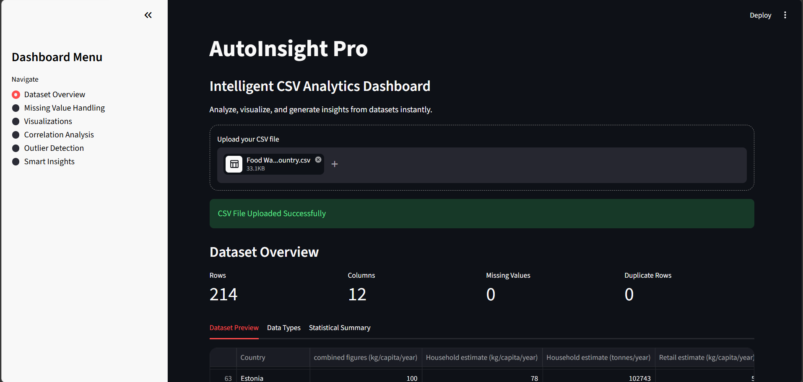
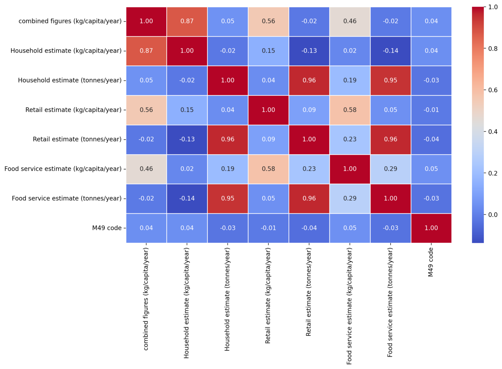
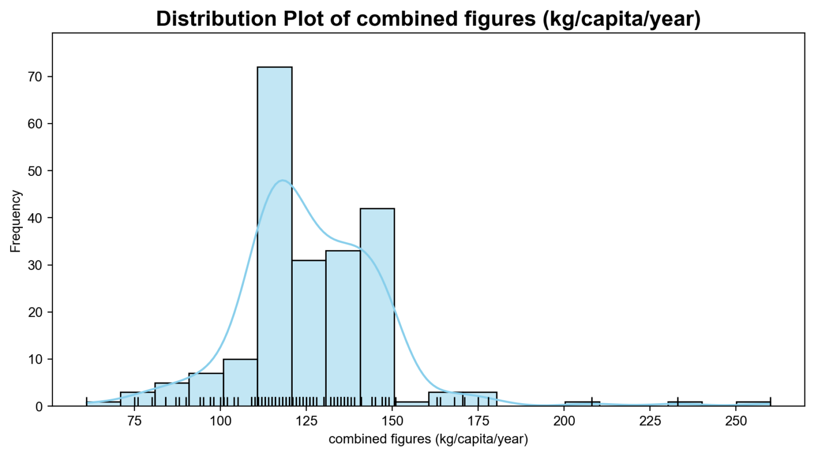
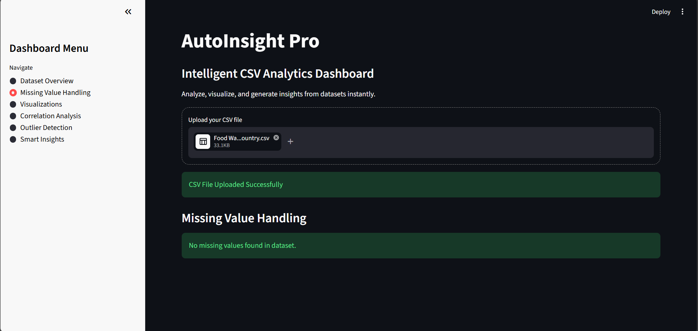
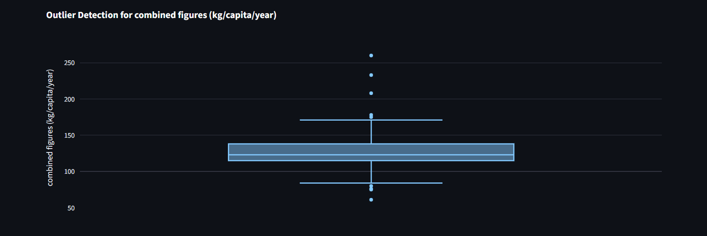
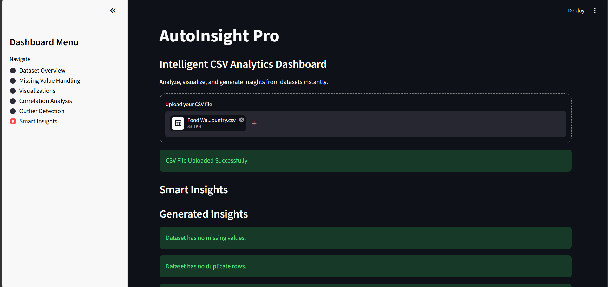

# AutoInsight Pro - Waste Management Data Analysis

AutoInsight Pro is an interactive Streamlit-based analytics dashboard designed for intelligent CSV data analysis. The platform enables preprocessing, visualization, correlation analysis, outlier detection, distribution analysis, and automated smart insights generation using real-world waste management datasets.

---

## Features

- CSV Dataset Upload
- Dataset Overview Dashboard
- Missing Value Detection & Handling
- Interactive Visualizations
- Correlation Heatmaps
- Missing Value Heatmaps
- Outlier Detection using IQR Method
- Distribution Analysis with Statistical Insights
- Automated Smart Insights Generation
- Interactive KPI Metrics
- Professional Animated Dashboard UI

---

## Technologies Used

- Python
- Streamlit
- Pandas
- Plotly Express
- Seaborn
- Matplotlib
- Missingno

---

## Key Capabilities

- Exploratory Data Analysis (EDA)
- Statistical Analysis & Interpretation
- Data Cleaning & Preprocessing
- Correlation Analysis
- Outlier Detection
- Distribution & Skewness Analysis
- Missing Value Imputation
- Automated Insight Generation
- Interactive Data Visualization

---

## Project Structure

```text
Waste-Management-Data-Analysis/
│
├── app.py
├── requirements.txt
├── README.md
├── .gitignore
│
├── dataset/
│   └── Food Waste data and research - by country.csv
│
├── images/
│   ├── dashboard_overview.png
│   ├── correlation_heatmap.png
│   ├── data_visualization.png
│   ├── missing_value_handling.png
│   ├── smart_insights.png
│   ├── outlier_boxplot.png
│   └── outlier_table.png
│
└── assets/
```

---

## Installation

Clone the repository:

```bash
git clone https://github.com/jeevanr17/Waste-Management-Data-Analysis.git
```

Move into the project directory:

```bash
cd Waste-Management-Data-Analysis
```

Install dependencies:

```bash
pip install -r requirements.txt
```

Run the application:

```bash
streamlit run app.py
```

---

## Dashboard Modules

### Dataset Overview
- Dataset preview
- Data type inspection
- Statistical summary
- KPI metrics
- Duplicate row detection

### Missing Value Handling
- Drop missing values
- Fill with mean
- Fill with median
- Fill with mode
- Fill using custom values

### Visualizations
- Histogram
- Bar chart
- Scatter plot
- Pie chart
- Distribution plot
- Skewness analysis

### Correlation Analysis
- Correlation heatmap
- Missing value heatmap

### Outlier Detection
- Interactive boxplots
- IQR-based outlier detection
- Outlier record visualization

### Smart Insights
- Missing value insights
- Duplicate data analysis
- Skewness detection
- Variance analysis
- Correlation detection
- Outlier analysis
- Categorical data insights

---

## Dataset Used

Food waste management dataset containing:
- Country-wise food waste statistics
- Household waste estimates
- Retail waste estimates
- Food service waste estimates
- Regional waste analysis

---

## Screenshots

### Dashboard Overview



---

### Correlation Heatmap



---

### Data Visualization



---

### Missing Value Handling



---

### Outlier Detection



---

### Smart Insights



---

## Live Demo

[Launch AutoInsight Pro](https://waste-management-data-analysis-xebrg2rw4dqcmijvw9pfsa.streamlit.app/)

## Future Improvements

- AI-powered recommendations
- Dataset quality scoring
- PDF report generation
- Machine learning integration
- Multi-file analytics
- Cloud deployment

---

## Author

Developed by Jeevan R  